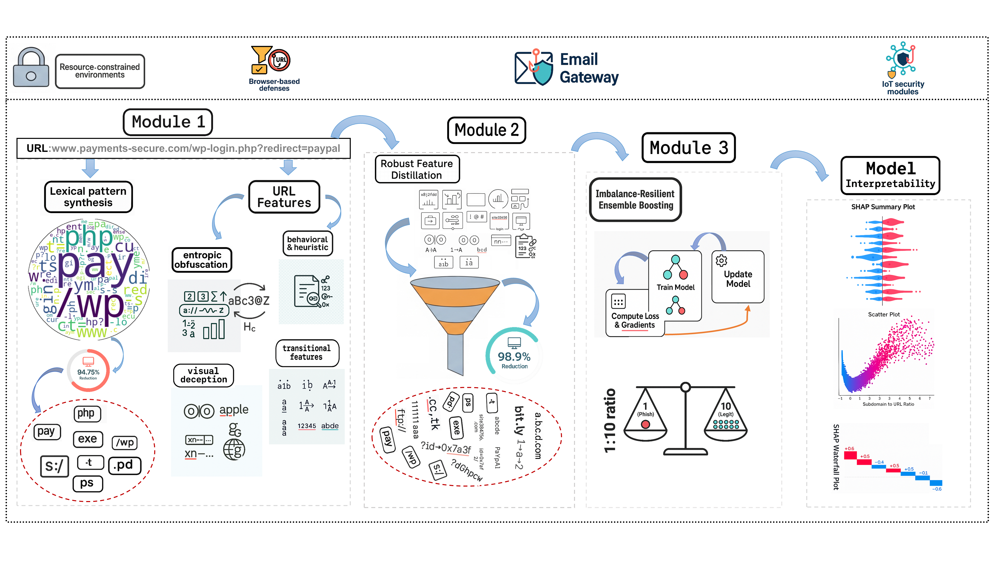

# Phishing Detection Pipeline

## Overview
This repository contains a machine learning pipeline for detecting phishing URLs, as detailed in the paper 'URL-Centric Phishing Detection via Cognitive Lexical Pattern Synthesis, Robust Feature Distillation, and Imbalance-Resilient Ensemble Boosting'. Our framework introduces novel techniques for robust and efficient phishing URL detection tailored for resource-constrained environments like email gateways, browser-level filters, and Internet of Things (IoT) security modules:

## Framework Architecture




Overview of the proposed framework. The Framework includes  three core phases: (1) Feature Extraction, N-gram Extraction, and Statistical Filtering; (2) Robust Feature Distillation, employing multistage hybrid feature selection; and (3) Imbalance-Resilient Ensemble Boosting with a Focal Loss-enhanced LightGBM framework, followed by model interpretation.

## Key Innovations of the Framework:
- **Deceptive Pattern Detectors:** extracting a novel suite of URL-exclusive features designed to effectively counter advanced phishing tactics by quantifying entropic obfuscation, identifying character-level spoofing, and capturing structural anomalies indicative of infrastructure evasio.
- **Cognitive Lexical Pattern Synthesis:** A novel method for selecting predictive n-grams by combining mutual information with L1-regularized logistic regression coefficients, effectively isolating patterns that are both statistically significant and semantically discriminative of phishing behavior.
- **Robust Feature Distillation**: Combines subsample-validated stability selection, dual importance scoring, and Pearson correlation-based redundancy pruning to produce a highly discriminative compact feature set.
- **Imbalance-Resilient Ensemble Boosting**: Empoly a custom LightGBM classifier with focal loss to effectively handle severe class imbalance.
## Repository Structure
```
phishing-detection/
├── Datasets                   # Datasets utilized in this research
├── figures                    # Figures
├── constants.py               # Configuration constants (e.g., suspicious terms, TLDs)
├── utils.py                   # Utility functions for URL processing
├── ngram_processing.py        # N-gram feature extraction and selection
├── model.py                   # Custom focal-loss LightGBM model
├── main.py                    # Main pipeline script
├── visualization.py           # Visualization functions for feature importance and SHAP
├── feature_selection.py       # Feature selection logic
├── feature_extraction.py      # Feature extraction from URLs
├── commands for visualization.txt # Commands to generate visualizations
├── README.md                  # Project documentation
├── .gitignore                 # Files to ignore in Git
├── requirements.txt           # Python dependencies
└── artifacts/                 # Output directory for model artifacts (excluded via .gitignore)
```

## Setup Instructions
1. **Clone the Repository**:
   ```bash
   git clone https://github.com/your-username/PhishDetecting.git
   cd PhishDetecting
   ```

2. **Create a Conda Environment**:
   ```bash
   conda create -n phishing python=3.9
   conda activate phishing
   ```

3. **Install Dependencies**:
   ```bash
   pip install -r requirements.txt
   ```

4. **Prepare Data**:
   - Place the `phishFusion.csv` dataset in `your_path/PhishFusion.csv` and update the path in `main.py`.

5. **Run the Pipeline**:
   ```bash
   python main.py
   ```

6. **Generate Visualizations**:
   - Refer to `commands for visualization.txt` for commands, e.g.:
     ```bash
     python visualization.py --viz_type shap_decision_plot --data_dir "artifacts"

     #SHAP Decision Plot for Specific Index (e.g., instance_idx 1)
     python visualization.py --viz_type shap_decision_plot --data_dir "artifacts" --instance_idx 1
     ```

## Dependencies
See `requirements.txt` for a complete list. Key libraries include:
- `numpy`
- `pandas`
- `scikit-learn`
- `lightgbm`
- `shap`
- `matplotlib`
- `seaborn`
- `tldextract`

## Usage
- **Training**: Run `main.py` to execute the pipeline, which saves model artifacts to the `artifacts/` directory. It also saves Test Set Metrics in the main directory.
- **Visualization**: Use `visualization.py` with specified arguments to generate plots (see `commands for visualization.txt`).
- **Customization**: Modify `constants.py` for different suspicious terms or TLDs, or adjust hyperparameters in `model.py`. Critically, the alpha (α) and gamma (γ) hyperparameters require careful tuning, as their optimal values are highly data-dependent and lack universal applicability across datasets. This dependency on manual tuning is a recognized limitation when adapting the model to different data distributions.

## Datasets
The pipeline uses the following datasets from the `dataset/` folder:
- `PhishFusion.csv`
- `phishstorm.csv`
- `ebbu2017.csv`
- `merged.csv`
## Artifacts
The pipeline saves the following in `artifacts/`:
- `model.pkl`: Trained model
- `train_features_selected.pkl`: Selected training features
- `test_features_scaled.pkl`: Scaled test features
- `test_labels.pkl`: Test labels
- `predictions.pkl`: Model predictions
- `selected_features.pkl`: Indices of selected features
- `all_feature_names.pkl`: Feature names
- `scaler.pkl`: StandardScaler object

## Notes
- The pipeline assumes each dataset with `url` and `phishing` columns.
- Visualizations require artifacts generated by `main.py`.
- The `phishing` Conda environment is recommended for compatibility.

